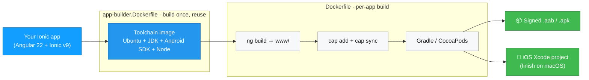

<div align="center">

# ⚡ Ionic Capacitor App Builder

**Produce a signed Android app (`.aab`/`.apk`) and a ready-to-finish iOS Xcode project from an Ionic app — using nothing but Docker.**

No local Android SDK, no Xcode-on-Linux gymnastics, no "works on my machine". Drop these files into your Ionic project and build.

[](https://github.com/capellasolutions/ionic-capacitor-docker/actions/workflows/build.yml)


</div>

> [!NOTE]
> **Prefer Cordova?** See the sibling project **[ionic-cordova-docker](https://github.com/capellasolutions/ionic-cordova-docker)**. This repo is the **Capacitor** port of it and defaults to **pnpm** instead of npm — the same pipeline, a different "way".

---

## Contents
- [Highlights](#highlights)
- [How it works](#how-it-works)
- [Quick start](#quick-start)
- [Repository layout](#repository-layout)
- [The demo app (`example-app`)](#the-demo-app-example-app)
- [Usage](#usage)
  - [1. Build the toolchain image](#1-build-the-toolchain-image)
  - [2. Build your app](#2-build-your-app)
  - [3. Get the build out](#3-get-the-build-out)
- [Verifying and using the Android build](#verifying-and-using-the-android-build)
- [Continuous integration](#continuous-integration)

---

## Highlights

- 🤖 **Reproducible builds in Docker** — a heavy, cacheable *toolchain image* (Ubuntu + JDK + Android SDK + Node) and a light *per-app build* on top of it.
- 🔐 **Signed Android releases** out of the box via Gradle's [injected signing properties](https://developer.android.com/build/building-cmdline#sign_cmdline) — the generated `android/` project needs no hand-edits.
- 🍏 **iOS prepared on Linux** — `cap sync` generates the Xcode workspace and runs `pod install`; you just finish the build on macOS.
- 🅰️ **Modern, zoneless stack** — Angular 22 + Ionic v9 (no `zone.js`), esbuild builder, TypeScript 6, Vitest.
- 📦 **Bring your own package manager** — `npm`, `yarn`, or `pnpm` via one build-arg; only the selected one is installed (no Corepack, future-proof for Node 25+).
- 🌱 **Fresh native projects every build** — `android/` and `ios/` are generated at build time (not committed), so the build is stateless and `appId` is injected per build.
- 🎯 **Dev/prod switching** — environment files and Firebase config are swapped at build time so one optimized build can target either backend.
- ✅ **CI included** — drift-guard, lint/build/test, and an end-to-end Android build; Dependabot keeps everything current.

## How it works

Capacitor replaces Cordova's `config.xml` with `capacitor.config.ts`. Because the native projects are generated fresh inside Docker on every build, the `Dockerfile` injects your `PACKAGE_ID` into `appId` **before** `cap add` runs — `appId` becomes the Android namespace/applicationId and the iOS bundle id.



## Quick start

The bundled **`example-app`** is self-contained — clone and build it to exercise the whole pipeline end-to-end:

```shell
cd example-app
./build-mobile.sh
```

That builds the toolchain image, builds the demo, and copies the artifact into `build-output/`. Pick a platform directly with `./build-mobile.sh android` (or `ios` / `all`).

## Repository layout

| Path | What it is |
| --- | --- |
| `app-builder.Dockerfile` | Builds the heavy **toolchain base image** (Ubuntu + JDK + Android SDK + Node + Angular/Ionic CLIs). Build it once and reuse it. Capacitor's own CLI is a project devDependency, so it is **not** installed globally here. |
| `Dockerfile` | `FROM app-builder` — copies your app in, builds the Angular web app, then generates + builds the native project with Capacitor. The per-app build. |
| `scripts/build-capacitor.sh` | The build helper the `Dockerfile` runs inside the image: builds the web app, runs `cap add` / `cap sync`, and produces a signed Android release with Gradle (or prepares the iOS Xcode project). |
| `build-mobile.sh` | Convenience wrapper that builds both images and copies the artifact out. |
| `example-app/` | A small **Angular 22 + Ionic v9 (zoneless) + Capacitor** demo you can clone and build immediately. |

> [!IMPORTANT]
> `example-app/` carries its **own copies** of the template files above, because Docker can't reach files outside its build context — the copies are required, not accidental. The root files are the source of truth; the `example-app` copies of `Dockerfile`, `app-builder.Dockerfile` and `scripts/build-capacitor.sh` are kept **byte-for-byte identical** (CI enforces this). `example-app/build-mobile.sh` is intentionally slightly different (it uses `version=0.0.0` and a self-contained header comment).

## The demo app (`example-app`)

The bundled demo is a small **Angular 22 + Ionic v9 + Capacitor** app that runs **fully zoneless** (no `zone.js`). It exercises the Docker pipeline end-to-end and doubles as an up-to-date reference for the modern toolchain:

- **Angular 22** with the esbuild `@angular/build:application` builder, standalone components and signals — zoneless by default (`provideZonelessChangeDetection()`), no `zone.js` in the bundle.
- **Ionic** pinned to a **v9 pre-release dev build** of `@ionic/angular` (`8.8.12-dev…`). v9 adds Angular 21/22 support and zoneless-by-default. Until it ships as stable (~Q3 2026) the pin is exact. **When `@ionic/angular@9` is released, bump the pin to `^9` and delete this note.**
- **Capacitor 8** (`@capacitor/core`, `@capacitor/android`, `@capacitor/ios`) with `@capacitor/cli` and `@capacitor/assets` as devDependencies, plus the `@capacitor/{status-bar,keyboard,device,splash-screen}` plugins. The About page reads `@capacitor/device` live, so you can see at a glance which flavour/platform you are running.
- **pnpm** is the default package manager (the Cordova sibling defaults to npm — this is the "different way"). An `.npmrc` sets `node-linker=hoisted` so pnpm's `node_modules` is flat enough for Capacitor to discover each plugin's native `android/` and `ios/` folders during `cap sync`.
- **TypeScript 6**, **Vitest** (jsdom) for unit tests, **angular-eslint** for linting.
- The toolchain base image builds on **Ubuntu 26.04**.

`pnpm run build` emits a flat `www/` (configured as `webDir` in `capacitor.config.ts`, so `cap sync` copies it into the native projects), and the production configuration swaps `src/environments/environment.ts` for `environment.prod.ts` — the Dockerfile first copies `environment.<ENV_NAME>.ts` over `environment.prod.ts` so one production build can target dev or prod.

The Android release is signed with Gradle's injected signing properties (`-Pandroid.injected.signing.*`) read from `keystore.properties` (Capacitor's analogue of Cordova's `build.json`).

## Usage

### 1. Build the toolchain image

It is separated so you don't waste time rebuilding it every time you build a new app.

```shell
docker build . -f ./app-builder.Dockerfile -t app-builder
docker push app-builder   # only if you distribute it to a registry
```

Optionally pass `--build-arg`s:

```shell
docker build . -f ./app-builder.Dockerfile \
  --build-arg PACKAGE_MANAGER=pnpm \
  --build-arg ANDROID_PLATFORMS_VERSION=36 \
  -t app-builder
```

*You can rename `app-builder` to whatever you like, but then change it inside `Dockerfile` too (the `FROM app-builder` line).*

<details>
<summary><b>Docker builder arguments</b> (defaults shown)</summary>

| Argument | Default | Notes |
| --- | --- | --- |
| `GRADLE_VERSION` | `8.14.5` | Gradle installed in the image. The generated Capacitor `android/` project runs its own `./gradlew` wrapper; the system Gradle mainly warms the wrapper's distribution cache (stay on Gradle 8.x for the AGP 8.x plugin). |
| `JAVA_VERSION` | `21` (LTS) | Capacitor 8's Android template uses AGP 8.x, which runs on JDK 21 with Gradle 8.x. JDK 25 would need AGP 9 / Gradle 9.1+. |
| `ANDROID_PLATFORMS_VERSION` | `36` | Android platform (compile/target SDK) to install. |
| `ANDROID_BUILD_TOOLS_VERSION` | `35.0.0` | The build-tools version Capacitor 8's Android Gradle Plugin pins — even though it compiles against platform 36. (build-tools and compile SDK are decoupled; AGP dictates build-tools.) |
| `ANDROID_SDK_TOOLS_VERSION` | `14742923` | Android command-line tools build number. |
| `PACKAGE_MANAGER` | `npm` | `npm`, `yarn`, or `pnpm`. The demo's `build-mobile.sh` passes `pnpm`. Only the **selected** manager is installed (npm ships with Node; yarn/pnpm are added on demand with `npm install -g`). This avoids Corepack, which is being unbundled from Node 25+. Also selects how `Dockerfile` installs *your app's* dependencies — commit the matching lockfile. |
| `NODE_VERSION` | `24` (LTS) | Node.js major (installed via NodeSource). |
| `YARN_VERSION` | `stable` | Yarn version (installed only when `PACKAGE_MANAGER=yarn`). |
| `PNPM_VERSION` | `latest` | pnpm version (installed only when `PACKAGE_MANAGER=pnpm`). |
| `USER` | `ionic` | Helpful for permissions. |
| `IONIC_CLI_VERSION` | `7.2.1` | Ionic CLI version (optional; Capacitor is driven via `npx cap` / `pnpm exec cap`). |

</details>

> [!TIP]
> Check the [Capacitor Android docs](https://capacitorjs.com/docs/android) first, keep `@capacitor/android` in `package.json` current, and make sure the generated project's compile/target SDK matches `ANDROID_PLATFORMS_VERSION`.

### 2. Build your app

```shell
docker build . \
  --build-arg ENV_NAME="${ENV_NAME}" \
  --build-arg PACKAGE_ID="${PACKAGE_ID}" \
  --build-arg PACKAGE_MANAGER=pnpm \
  --build-arg PLATFORM=${platform} \
  --build-arg VERSION="${version}" \
  -f ./Dockerfile \
  -t app-build
```

| Argument | Meaning |
| --- | --- |
| `PACKAGE_ID` | The bundle id for your app — injected into `appId` in `capacitor.config.ts` before the native project is generated. |
| `ENV_NAME` | `prod` or `dev`, depending on what your environment files are called inside the `environments` folder. |
| `PLATFORM` | `ios`, `android`, or both via `all`. |
| `VERSION` | Optional override for the app version (read from `package.json`). See `Dockerfile` and uncomment the line that sets it. |
| `PACKAGE_TYPE` | Android artifact type — `bundle` (`.aab` for Google Play, default) or `apk` (installable on a device). Selects the Gradle task (`bundleRelease` vs `assembleRelease`). |

### 3. Get the build out

**Android:**
```shell
docker run --user root:root --privileged=true -v ./build-output:/app/mount:Z --rm --entrypoint cp app-build -r ./output/android /app/mount
```

**iOS** (can only be *prepared* on Linux, never compiled — finish on macOS):
```shell
docker run --user root:root --privileged=true -v ./build-output:/app/mount:Z --rm --entrypoint cp app-build -r ./output/ios /app/mount
cd ./build-output/ios/App && pod repo update && pod install
```

There is a `build-mobile.sh` file if you want to run all these steps from a shell (you can comment out the first part later).

## Verifying and using the Android build

The Android build is copied to `build-output/android`. By default it produces a **signed Android App Bundle** (the file you upload to the Google Play Console):

```
build-output/android/app/build/outputs/bundle/release/app-release.aab
```

Verify the artifact is signed:

```shell
jarsigner -verify build-output/android/app/build/outputs/bundle/release/app-release.aab
# -> "jar verified."
```

An `.aab` cannot be installed on a device directly. To get an **installable APK** (e.g. for sideload testing), build with `PACKAGE_TYPE=apk`:

```shell
PACKAGE_TYPE=apk ./build-mobile.sh android
```

The APK then lands under `build-output/android/app/build/outputs/apk/release/`. Alternatively, generate APKs from an existing bundle with [bundletool](https://developer.android.com/tools/bundletool):

```shell
bundletool build-apks --mode=universal \
  --bundle=app-release.aab --output=app.apks \
  --ks=keys/android.jks --ks-key-alias=alias_name
```

> [!WARNING]
> **Signing key:** the demo signs with the committed `keys/android.jks` (passwords `Changeit` in `keystore.properties`). For a real app, generate your **own** keystore, keep it out of source control, and supply the passwords via secrets/environment — an app signed with the demo key can never be updated on Play by you.

## Continuous integration

`.github/workflows/build.yml` runs on push/PR and:

1. checks the `example-app` template copies (`Dockerfile`, `app-builder.Dockerfile`, `scripts/build-capacitor.sh`) haven't drifted from the root files,
2. lints, builds and unit-tests the demo app with pnpm, and
3. builds the toolchain image and the demo Android app end-to-end.

`.github/dependabot.yml` keeps the demo's dependencies (it reads `pnpm-lock.yaml`), the Docker base images, and the GitHub Actions up to date.

---

<div align="center">

Good Luck 🧡

**[Al-Mothafar Al-Hasan](https://github.com/almothafar)** from **[Capella Solutions](https://www.capellasolutions.com/)**

</div>
